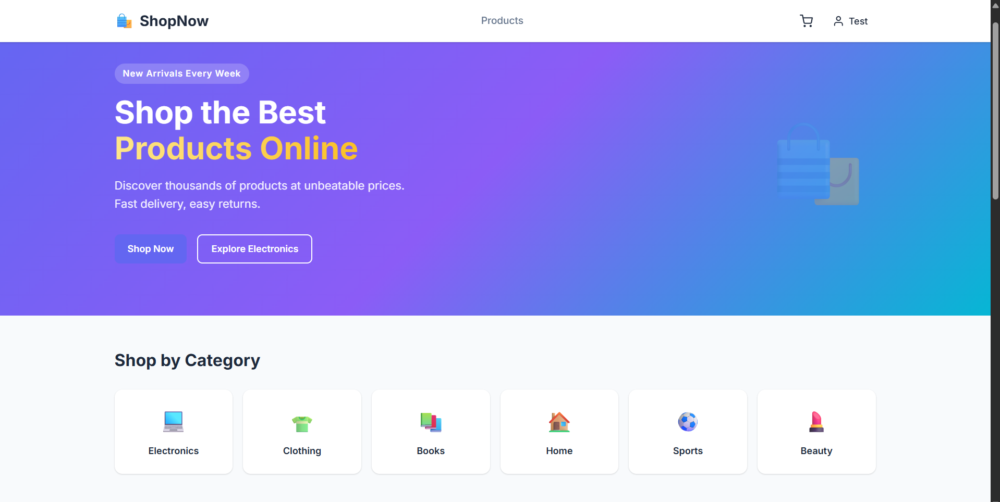
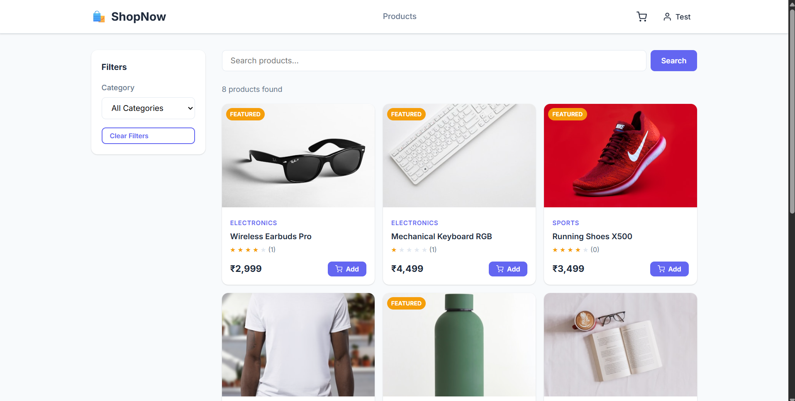
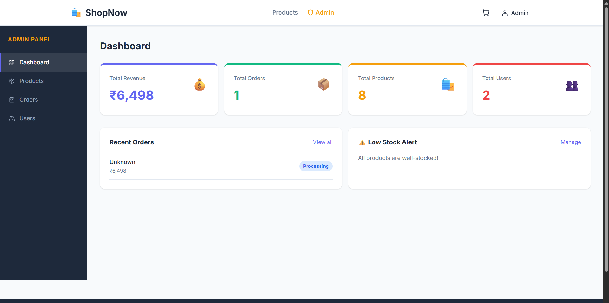

## Live Demo
- **Frontend:** https://shopnow-navy.vercel.app
- **Backend API:** https://shopnow-0nag.onrender.com


# ShopNow - Full Stack E-Commerce Application

A complete MERN stack e-commerce application with product catalog, cart, checkout, order tracking, and full admin panel.


## 📸 Screenshots

### Home Page


### Products


### Admin Dashboard



## Tech Stack
- **Frontend:** React 18 + Vite + React Router v6
- **Backend:** Node.js + Express.js
- **Database:** MongoDB (Atlas)
- **Auth:** JWT (JSON Web Tokens)
- **Styling:** Custom CSS with CSS Variables

## Features

### User
- Product catalog with search, filter by category, pagination
- Product detail page with reviews
- Add to cart, update quantity, remove items
- Checkout with shipping address & payment method selection
- Order history and order detail tracking
- User profile management

### Admin
- Dashboard with revenue, orders, users, low-stock alerts
- Full product CRUD (create, edit, delete, feature)
- Order management with status updates
- User management (delete, promote/demote admin)


## API Endpoints Summary

| Method | Route | Auth | Description |
|--------|-------|------|-------------|
| POST | /api/auth/register | - | Register user |
| POST | /api/auth/login | - | Login |
| GET | /api/auth/profile | User | Get profile |
| GET | /api/products | - | List products |
| GET | /api/products/:id | - | Product detail |
| POST | /api/products | Admin | Create product |
| PUT | /api/products/:id | Admin | Update product |
| DELETE | /api/products/:id | Admin | Delete product |
| GET | /api/cart | User | Get cart |
| POST | /api/cart/add | User | Add to cart |
| POST | /api/orders | User | Place order |
| GET | /api/orders/myorders | User | My orders |
| GET | /api/orders | Admin | All orders |
| PUT | /api/orders/:id/status | Admin | Update status |
| GET | /api/admin/dashboard | Admin | Dashboard stats |
| GET | /api/admin/users | Admin | All users |

---

## Project Structure
```
shopnow/
├── backend/
│   ├── config/db.js
│   ├── controllers/
│   │   ├── authController.js
│   │   ├── productController.js
│   │   ├── orderController.js
│   │   ├── cartController.js
│   │   └── adminController.js
│   ├── middleware/authMiddleware.js
│   ├── models/
│   │   ├── User.js
│   │   ├── Product.js
│   │   ├── Order.js
│   │   └── Cart.js
│   ├── routes/
│   │   ├── authRoutes.js
│   │   ├── productRoutes.js
│   │   ├── orderRoutes.js
│   │   ├── cartRoutes.js
│   │   └── adminRoutes.js
│   ├── seed.js
│   ├── server.js
│   └── .env.example
└── frontend/
    ├── src/
    │   ├── components/
    │   │   ├── admin/AdminLayout.jsx
    │   │   ├── layout/Navbar.jsx + Footer.jsx
    │   │   └── products/ProductCard.jsx
    │   ├── context/
    │   │   ├── AuthContext.jsx
    │   │   └── CartContext.jsx
    │   ├── pages/
    │   │   ├── admin/ (Dashboard, Products, Orders, Users, ProductForm)
    │   │   ├── Home.jsx
    │   │   ├── ProductsPage.jsx
    │   │   ├── ProductDetail.jsx
    │   │   ├── CartPage.jsx
    │   │   ├── CheckoutPage.jsx
    │   │   ├── OrdersPage.jsx
    │   │   ├── OrderDetail.jsx
    │   │   ├── ProfilePage.jsx
    │   │   ├── LoginPage.jsx
    │   │   └── RegisterPage.jsx
    │   ├── utils/api.js
    │   ├── App.jsx
    │   └── main.jsx
    └── vite.config.js
```
